Chapter 3 程序的机器级表示 II：控制

[[toc]]

# 3.6 控制

机器代码提供了两种基本的低级机制来实现有条件的行为：测试数据值，然后根据测试的结果来改变控制流或者数据流。

本文会先涉及实现条件码操作的两种方式，然后描述表达循环和 switch 语句的方法。

## 3.6.1 条件码

除了整数寄存器，CPU 还维护着一组单个位的条件码寄存器，_它们描述了最近的算术或者逻辑操作的属性_。

| 位  |            标志             | 解释                                                                       |
| --- | :-------------------------: | :------------------------------------------------------------------------- |
| CF  |   进位标志（Carry Flag）    | 最近的操作使最高位产生了进位。可以用来检查无符号操作的溢出                 |
| ZF  |     零标志（Zero Flag）     | 最近的操作得出的结果为 0                                                   |
| SF  |    符号标志（Sign Flag）    | 最近的操作得到的结果为负数                                                 |
| OF  |  溢出标志（Overflow Flag）  | 最近的操作导致一个补码溢出——正溢出或负溢出                                 |
| PF  | 奇偶校验标志（Parity Flag） | 最近产生的结果中低 8 位中 1 的个数，若为奇数个，则 PF = 0；偶数个则 PF = 1 |

::: details Example
假设我们用 Add 指令完成 t = a + b 操作（这里都是整型），则根据以下 C 表达式来设置条件码：


:::

- **leaq 指令不改变任何条件码**，因为它只用来进行地址计算，除此之外，图 3-10 列出的指令都会设置条件码。
- <a-tag color="cyan">不需要记</a-tag>对于逻辑操作（如 XOR），进位标志和溢出标志会设置成 0。
- <a-tag color="cyan">不需要记</a-tag>对于移位操作，进位标志被设置为最后一个移出的位，而溢出标志设置为 0。
- <a-tag color="cyan">不需要记</a-tag>INC 和 DEC 指令会设置溢出和零标志，但是不会改变进位标志。

### CMP 指令与 TEST 指令

它们只设置条件码而不改变任何其他寄存器

**CMP 指令**根据两个操作数之差来设置条件码，其置位行为与 SUB 指令相同。

> 当相等时，置 ZF = 1，即相等得 0

**TEST 指令**的置位行为与 AND 指令一样，其典型用法是：

- <a-tag color="blue">重要</a-tag>两个操作数是一样的，例如`testq %rax, %rax`，用来检查 %rax 是负数是零，还是正数。此时相当于`cmpq $0, %rax` 。
- 其中的一个操作数是一个掩码，用来指示哪些位应该被测试。

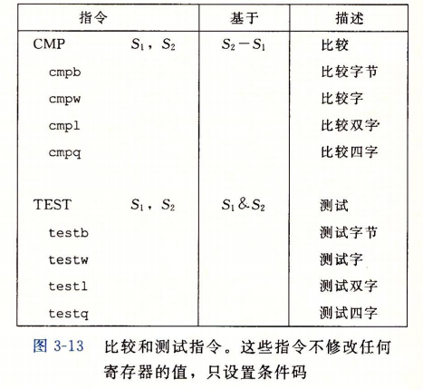

## 3.6.2 访问条件码：setX 指令

条件码通常不会直接读取，常用的使用方法有三种：

1. 【setX 指令】可以根据条件码的某种组合，将一个字节设置为 0 或 1；
2. 【jX 指令】可以条件跳转到程序的某个其他的部分；
3. 【cmovX 指令】可以有条件地传送数据。

**SET 指令**根据条件码的某种组合，将一个字节设置为 0 或 1，他们之间的区别就在于他们考虑的条件码组合是什么，其名字的后缀指明了他们所考虑的条件码的组合。

<u>一条 SET 指令的目的操作数是低位单字节寄存器元素之一，或是一个字节的内存位置，指令会将这个字节设置为 0 或 1</u>。为了得到一个 32/64 位结果，须将高位清零。

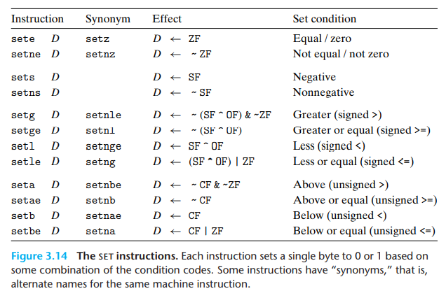

::: details 助记

- e 有同名 z，因为 equal 是判断 ZF 是否置位，故 z 表示 Zero Flag，与 e（equal）意义相同。后面的 jX、cmovX 也有这个规律。
- 仅带 e、ne 而不带 g、l、a、b 时，操作数有符号/无符号均可。
- 有符号用 greater 和 less 比大小，无符号用 above 和 below。
  :::

::: details Example

```
// int comp(data_t a, data_t b)
// a in %rdi, b in %rsi

comp:
    cmpq %rsi, %rdi         Compare a:b
    setl %al                Set low-order byte of %eax to 0 or 1
    movzbl %al, %eax        Clear rest of %eax (and rest of %rax)
    ret
```

- <a-tag color="blue">易错</a-tag>注意 cmpq 指令的比较顺序，虽然参数列出的顺序先 b 再 a，但实际上比较的是 a 和 b。
- line7 的 movzbl 指令不仅会把 %eax 高 3 个字节清零，还会把整个寄存器 %rax 的高 4 个字节都清零（因为任何为 32 为 reg 生成结果的指令都会把该 reg 的高位部分清零）。
  :::

注意到机器代码如何区分 unsigned 和 signed 是很重要的：

- 大多数情况下，对 signed 和 unsigned 使用一样的指令；
- 有些情况下要用不同的指令来处理 signed 和 unsigned 操作，如不同版本的右移、除法和乘法指令，以及不同的条件码组合。

## 3.6.3 跳转指令

跳转（jump）会导致执行切换到程序的一个全新的位置，在汇编中，这些跳转的目的地通常用一个**标号**（label）来标明。<u>在产生目标代码文件时，汇编器会确定所有带标号指令的地址，并将跳转目标（目的指令的地址）编码为跳转指令的一部分</u>。

### 无条件跳转

jmp 指令是无条件跳转，它分为：

- **直接跳转**，即跳转目标是作为指令的一部分编码的。在汇编中，直接跳转是给出一个标号作为跳转目标
- **间接跳转**，即跳转目标是从寄存器或者内存位置中读出的。在汇编中，其写法是 `*` 后面跟一个操作数指示符。

::: details Example
`jmp *%rax` 从 %rax 中的值作为跳转目标；`jmp *(%rax)` 以 %rax 中的值作为读地址，从内存中读出跳转目标。
:::

### 有条件跳转

它们根据条件码的某种组合，或者跳转，或者继续执行代码序列的下一条指令：

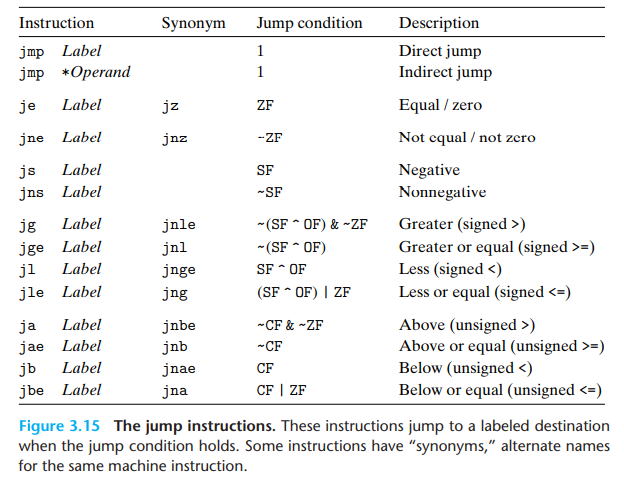

- 条件跳转只能是直接跳转，即只能给出一个标号作为跳转地址。
- 这些指令的名字和跳转条件与 SET 指令是相匹配的。

## 3.6.4 跳转指令的编码

在汇编代码中，跳转目标用符号标号书写。汇编器、链接器会产生跳转目标的适当编码。编码方式有：

1. **PC 相对的偏移量**：它们会将目标指令的地址与紧跟在跳转指令**后面那条指令的地址**<a-tag color="blue">易错</a-tag>之间的差作为偏移量进行编码。（之所以是后面那条指令的地址，是因为 CPU 在取出指令后 PC 在指令执行前就递增了）
2. **绝对地址**，用 4 个字节直接指定跳转目标。

**使用偏移量跳转的好处**：指令编码简洁，而且目标代码可以不做改变就移到内存中的不同位置。

::: details Example

```
4004d0: 48 89 f8        mov   %rdi,%rax
4004d3: eb 03           jmp   4004d8 <loop+0x8>
4004d5: 48 d1 f8        sar   %rax
4004d8: 48 85 c0        test  %rax,%rax
4004db: 7f f8           jg    4004d5 <loop+0x5>
4004dd: f3 c3           repz  retq
```

- 其中 rep、repz 指令无视即可。
  :::

跳转指令提供了一种实现条件执行（if）和几种不同循环结构的方式。

## 3.6.5 用条件控制来实现条件分支

将条件表达式和语句从 C 语言翻译成机器代码，最常用的方式就是结合有条件和无条件跳转，有些条件可以用数据的条件转移实现，而不是用控制的条件转移实现。

::: details Example
例如，下面给出了一个计算两数之差绝对值的函数的 C 代码，以及 GCC 产生的汇编代码

原始的 C 语言代码：

```c
long lt_cnt = 0;
long ge_cnt = 0;

long absdiff_se(long x, long y)
{
    long result;
    if (x < y) {
        lt_cnt++;
        result = y - x;
    }
    else {
        ge_cnt++;
        result = x - y;
    }
    return result;
}
```

与之等价的 goto 版本：

```c
long gotodiff_se(long x, long y)
{
    long result;
    if (x >= y)
        goto x_ge_y;
    lt_cnt++;
    result = y - x;
    return result;
x_ge_y:
    ge_cnt++;
    result = x - y;
    return result;
}
```

产生的汇编代码：
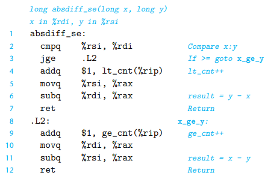
:::

C 语言的 if-else 语句的通用形式模板如下：

```c
if (test)
    then-statement
else
    else-statement
```

其汇编实现会使用下面这种形式（用 C 语法来描述控制流）：

```c
    t = text-expr
    if (!t)
        goto false;
    // then-statement，是顺着 if 写下去的（成功时顺着下去）
    goto done;
false:
    // else-statement，是跳出去的（失败时跳出去）
done:
```

## 3.6.6 用条件传送实现条件分支

实现条件操作的传统方法是通过控制的条件转移，这种机制简单但效率低。一种替代策略是**使用数据的条件转移**，这种方法计算一个条件操作的两种结果，然后再根据条件是否满足从中选取一个。

> 这种策略只在一些受限制的情况下才可行，但如果可行，就可以用一条指令来实现它，这样产生的指令控制流不再依赖于测试数据，使得处理器更容易保持流水线是满的。

::: details 条件传送的例子
计算参数 x 与 y 差的绝对值

原始 C 代码：

```c {5, 7}
long absdiff(long x, long y)
{
    long result;
    if (x < y)
        result = y - x;  // see here
    else
        result = x - y;  // see here
    return result;
}
```

使用条件赋值的实现：

```c
long cmovdiff(long x, long y)
{
    // 计算一个条件操作的两个结果
    long rval = y - x;
    long eval = x - y;

    long ntest = x >= y;
    // 根据条件是否满足从中选取一个结果
    if (ntest)
        rval = eval;

    return rval;
}
```

产生的汇编代码：

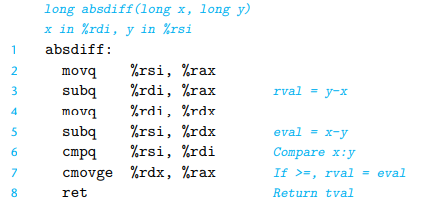
:::

### 条件传送指令

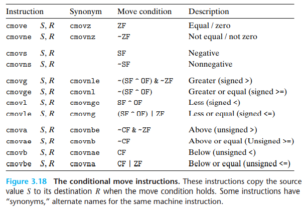

- 每条指令都有两个操作数，源寄存器或内存地址 S，和目的寄存器 D。
- 指令的结果取决于条件码的值，源值可以来自内存或 reg，<u>但是只有在指定的条件满足时才会被复制到目的寄存器中</u>。
- 不支持单字节的条件传送
- 汇编器可以从目标寄存器的名字推断出条件传送指令的操作数长度，所以对于不同长度可以使用同一个指令名字。

相比于条件跳转，执行条件传送指令时是顺序执行，不会发生跳去其他代码的情况，CPU 无须预测测试结果就可以执行条件传送。

### 条件传送的不良案件

1. 计算代价太大：`val = Test(x) ? Hard1(x) : Hard2(x);`
2. 危险的计算：`val = p ? *p : 0;`
3. 有副作用的计算：`val = x > 0 ? x *= 7 : x += 3;`

::: tip
重要的是，因为无论测试结果如何，我们都会对 then-expr 和 else-expr 求值，当两个表达式中的任意一个可能产生错误条件或者副作用，就会导致非法的行为。
:::

实验表明，只有当两个表达式都很容易计算时，例如表达式分别都只是一条加法指令时，他才会使用条件传送。

## 3.6.7 循环

汇编用条件测试 + 跳转实现 C 语言的多种循环结构，即 do-while、while 和 for。

### （1）do-while 循环

do-while 通用形式：

```c
do
    body-statement
    while (test-expr)
```

可以看到，body-statement 至少执行一次。这种通用形式被翻译成如下的条件和 goto 语句：

```c
loop:
    body-statement
    t = test-expr
    if (t)
        goto loop
```

::: details Example

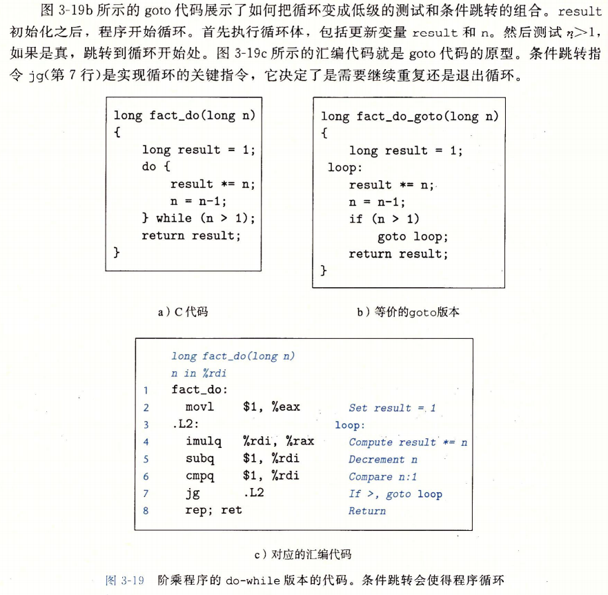

:::

### （2）while 循环

while 通用形式：

```c
while (test-expr)
    body-statement
```

与 do-while 不同的是，在第一次执行 body 前，它会对 test-expr 求值，循环可能就终止了。

有两种实现翻译方法：

#### 翻译方法 1：**跳转到中间**（jump to middle）

它执行一个无条件跳转跳到循环结尾处测试，以此来执行初始的测试：

```c
    goto test;
loop:
    body-statement
test:
    t = test-expr;
    if (t)
        goto loop;
```

::: details "跳转到中间" Example
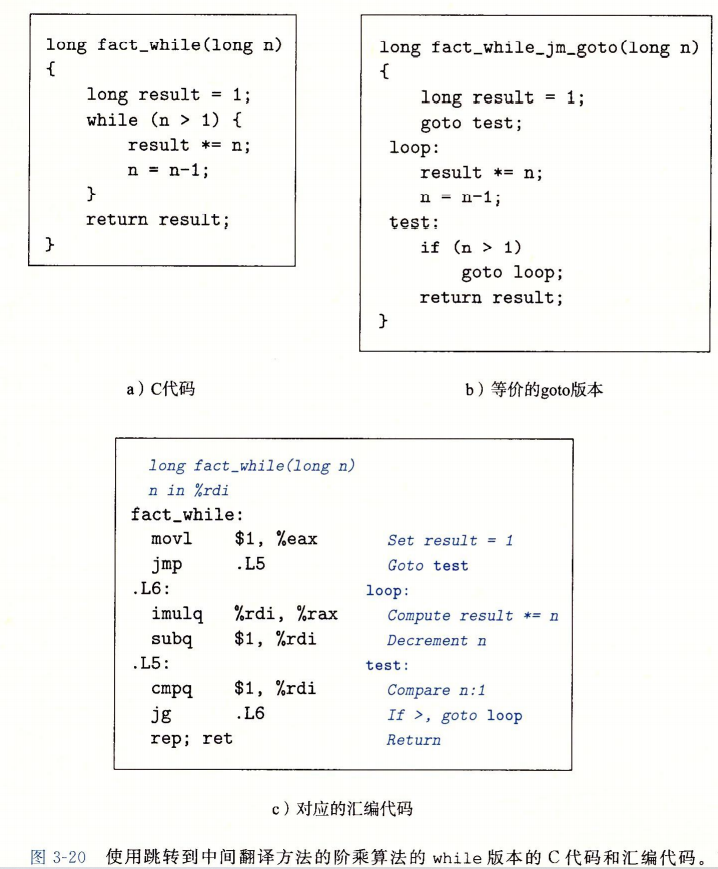
:::

#### 翻译方法 2：**guard-do**

首先使用条件分支，如果初始条件不成立就跳过循环，把代码变换成 do-while 循环：

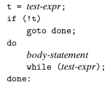

相应的，还可以翻译成 goto 代码如下：

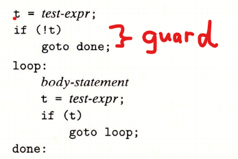

::: details "guard-to" Example

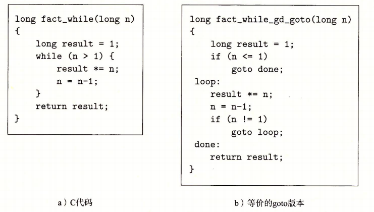
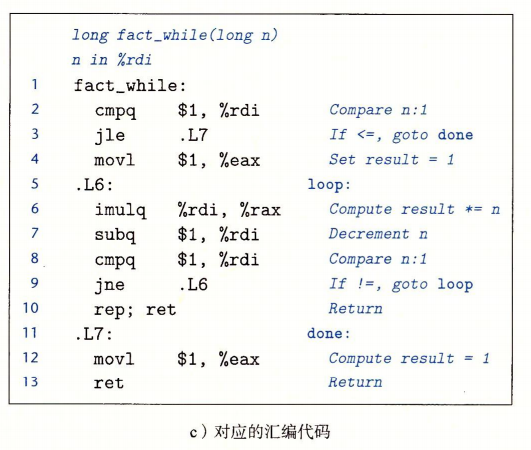

:::

### （3）for 循环

for 通用形式：

```c
for (init-expr; test-expr; update-expr)
    body-statement
```

这样的循环与下面这段使用的 while 循环行为相同：

```c
init-expr;
while (test-expr) {
    body-statement
    update-expr;
}
```

GCC 为 for 循环产生的代码是 while 循环的两种翻译之一，这取决于优化的等级。

#### 跳转到中间的翻译策略:

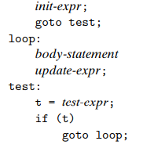

#### guarded-do 的翻译策略：

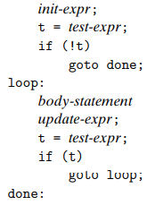

::: tip 总结
综上所述，C 语言的三种形式的循环都可以用一种简单的策略来翻译，产生包含一个或多个条件分支的代码。控制的条件转移机制提供了将循环翻译成机器代码的基本机制。
:::

## 3.6.8 switch 语句

这个语句特别有用，它不仅提高了 C 代码的可读性，而且通过使用跳转表这种数据结构使得实现更加高效。和使用很长的 if-else 相比，使用跳转表的优点是执行开关语句的时间与开关情况的数量无关。

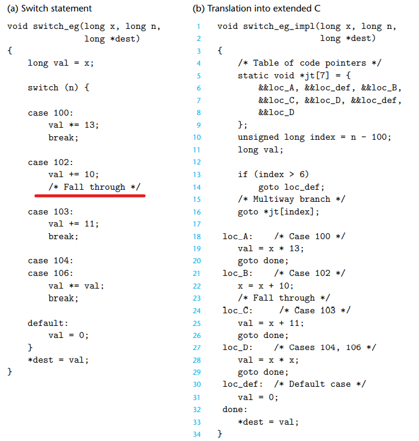

其汇编代码如下：

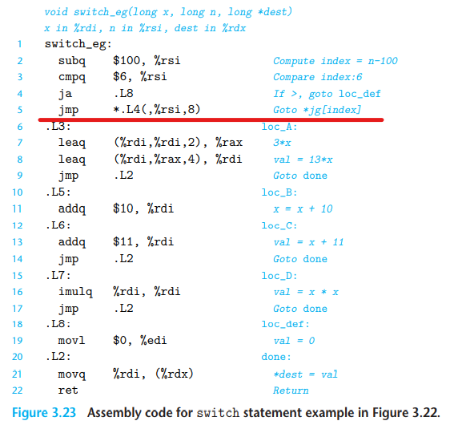

- 直接跳转：`jmp .L8` 跳转到标号 .L8 处
- 间接跳转：`jmp *.L4(, %rdi, 8)` 跳转表的起始地址：.L4

执行 switch 语句的关键步骤是通过跳转表来访问代码的位置。可以观察到，跳转表对重复情况的处理就是简单地对表项 4、6 用同样的代码标号 loc_D，而对于确实的情况的处理就是对 1、5 使用默认情况的标号 loc_def。

在汇编代码中，跳转表用以下声明表示：

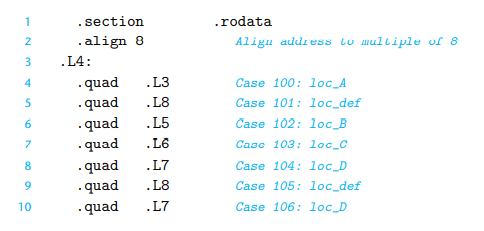

- **处理下穿**（Fall Through）：不同的代码块实现了 switch 语句的不同分支。当 C 语言中没有 break 而下穿时，汇编中在块结尾就没有 jmp 指令，这样代码就会继续执行下一个块。
- 关键是领会使用跳转表是一种非常有效的实现多重分支的方法。
