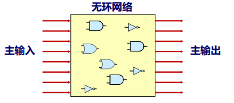
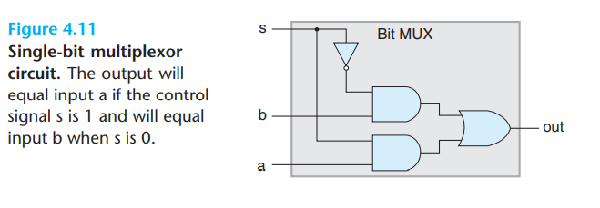
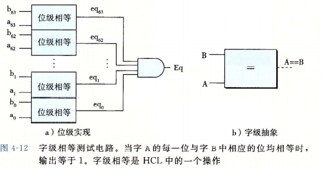
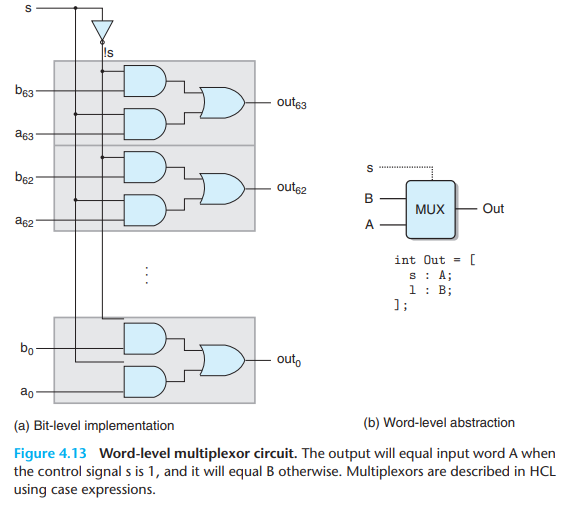
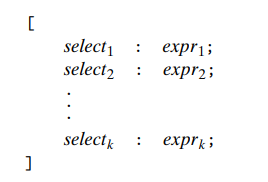
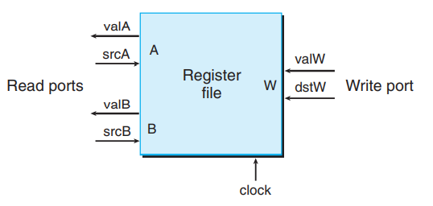
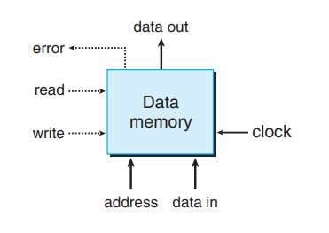

Chapter 4 处理器体系结构 II：逻辑设计与硬件控制语言 HCL

# 4.2 逻辑设计与硬件控制语言 HCL

[[toc]]

要实现一个数字系统需要三个主要的组成部分：
- 计算对位进行操作的函数的组合逻辑；
- 存储位的存储器单元；
- 控制存储器单元更新的时钟信号。

## 4.2.1 逻辑门

逻辑门是数字电路的基本计算单元。他们产生的输出，等于它们输入位值的某个布尔函数。


+ 输出是输入的布尔函数；
+ 连续响应输入的变化（有较小的延迟）。

::: warning
HCL 布尔操作语法与 C 语言的逻辑运算类似，注意区分。<a-tag color="blue">易错</a-tag>
:::

::: details HCL 与 C 语法的区别
1. 组合电路的输出会持续地响应输入的变化，而 C 表达式只会在执行过程中被遇到时才求值；
2. 逻辑门只对位值 0 和 1 操作；
3. 组合逻辑没有”短路求值“的特点。
:::

## 4.2.2 组合电路和 HCL 布尔表达式

**组合电路**：将很多的逻辑门组合成一个网，就能构建计算块，称为组合电路。



构建组合电路的**限制**：
+ 每个逻辑门的<u>输入必须连接到下述选项</u>之一：① 一个系统输入（称为主输入）；② 某个存储器单元的输出；③ 某个逻辑门的输出。
+ 两个或多个逻辑门的<u>输出不能连接在一起</u>。否则信号矛盾。
+ <u>无环网络</u>。

### 位相等示例


```hcl
# 位相等表达式
bool eq = (a && b) || (!a && !b);
```

### 位多路复用器

**多路复用器**（multiplexor, MUX）,多路复用器根据输入控制信号的值，从一组不同的数据信号中选出一个。



+ AND 门决定了是否将它们相对应的数据输入传送到 OR 门

```hcl
# 位多路复用器表达式
bool out = (s && a) || (!s && b);
```

## 4.2.3 字级的组合电路和 HCL 整数表达式

将逻辑门进行组合，通常可以设计出能对数据字(word)进行操作的电路。执行字级计算的组合电路根据输入字的各个位，用逻辑门来计算输出字的各个位。

### 字相等示例



::: tip HCL 语法
+ 在 HCL 中，我们将所有字级的信号都声明为 int，不指定字的大小。

+ HCL 允许比较字是否相等：`bool Eq = (A == B);`
:::

### 字多路复用器



::: tip HCL 语法：情况表达式
在 HCL 中，多路复用函数是用情况表达式(case expression)来描述的：



这个表达式包含一系列情况，每种情况 $i$ 都有一个布尔表达式 $select_i$ 和一个整数表达式 $expr_i$，前者标明什么时候该选择这种情况，后者指明的是得到的值。

+ 不要求不同的选择表达式之间互斥。从逻辑上讲，这些选择表达式是顺序求值，且第一个求值为 1 的情况会被选中。
+ 最后一个选择表达式为 `1` 是 HCL 一种指定默认情况的方法。
+ 选择表达式可以是任意的布尔表达式，可以有任意多的情况。
+ 选择表达式有时可以简化，因为只有第一个匹配的情况才会被选中。
:::

::: details 情况表达式示例：选最小值


```hcl
word Min3 = [
    A <= B && A <= C : A;
    B <= A && B <= C : B;
    1 : C;
];
```

:::


### 算术/逻辑单元 ALU

这个电路有三个输入：标号为 A 和 B 的两个数据输入，以及一个控制输入（决定执行何种运算）：


+ 注意减法的操作数顺序 <a-tag color="blue">易错</a-tag>，是输入 B 减去输入 A，这么做是为了与 `subq` 指令参数顺序一致。

## 4.2.4 集合关系

**应用场景**：很多时候都需要将一个信号与许多可能匹配的信号做比较，以此来检测正在处理的某个指令代码是否属于某一类指令代码。

判断集合关系的通用格式：


+ 这里所有值都是整数表达式。

## 4.2.5 存储器和时钟

组合电路从本质上讲，并不存储任何信息。为了产生时序电路，我们必须引入按位存储信息的设备。

**存储设备**都是由同一个*时钟* 控制的，时钟是一个周期性信号，决定什么时候要把新值加载到设备中。考虑两类存储器设备：
+ **时钟寄存器**（简称**寄存器**）：存储单个位或字，时钟信号控制寄存器加载输入值；
+ **随机访问存储器**（简称**内存**）：存储多个字，用地址来选择该读或者该写哪个字。其例子包括：
  + 处理器的虚拟内存系统
  + 寄存器文件：寄存器标识符作为地址  

::: details 区别硬件寄存器和程序寄存器 <a-tag color="blue">易混淆</a-tag>
说到硬件和机器级编程时，“寄存器”这个词代表不同含义。
+ **硬件寄存器**：在硬件中，寄存器直接将它的输入和输出线连接到电路的其他部分；
+ **程序寄存器**：在机器级编程中，寄存器代表的是 CPU 中为数不多的可寻址的字，这里的地址是寄存器 ID，这些字通常都存到寄存器文件中。
:::

### 时钟寄存器


硬件寄存器的工作方式：


+ 存储数据位；
+ 作为电路不同部分中的组合逻辑之间的屏障；
+ 当时钟上升的时候，加载输入。

### 寄存器文件



+ 有两个读端口（A、B）和一个写端口（W），允许同时进行多个读和写操作。
+ 每个端口都有一个地址输入用来表明选择哪个寄存器。
+ 寄存器文件不是组合电路，因为它有内部存储。不过我们在从中读数据时，仍可以将其视为一个以地址为输入、数据为输出的组合逻辑块。
+ 向寄存器文件写入字是由时钟信号控制的，控制方式类似于将值加载到时钟寄存器。
+ 当同时读写一个寄存器时，我们会看到一个从旧值变化到新值的过程。

::: tip 
**读**：
- 类似组合逻辑；
- 根据输入地址产生输出数据（有延迟）。

**写**：
- 类似寄存器；
- 只在时钟上升沿更新。
:::

### 随机访问存储器（内存）



内存工作方式：


我们的处理器还包括另外一个只读存储器，用来读指令。
